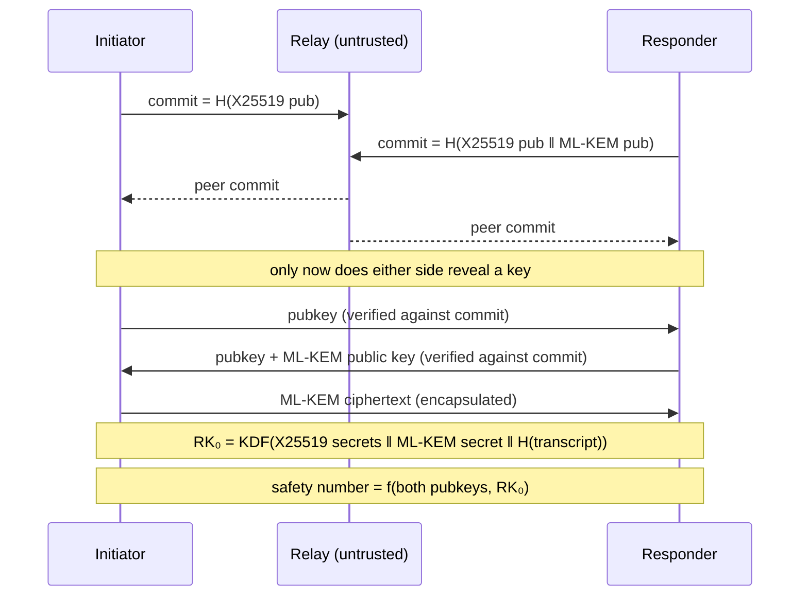

# Trojan Troy

**Trojan Troy smuggles your conversations past everyone but the person you're talking to.**

Text and voice messages encrypted end-to-end. A safety-number handshake so you know it's really them. A relay server that is *architecturally incapable* of reading a single word — not "promises not to," can't.

🔗 **Live demo:** _add your Vercel URL_ — open it in two browsers, "Start a chat" in one, join with the code in the other.

---

## The one-sentence version

Most "encrypted" chat apps ask you to trust their server. This one is built so that the server's honesty is irrelevant: it forwards opaque blobs it has no key for, and every design decision assumes it is actively hostile.

## What the relay actually sees

After the handshake, every single message — text, voice note, typing indicator, read receipt, shared profile — looks like **exactly this** on the wire:

```json
{ "type": "msg", "payload": "3q2+7wAAAAB...base64..." }
```

That's it. There is no message type, no sender key, no counter, no length, no id. All of it — the channel, the message id, the voice mimeType, the receipt kind, the ratchet position, the sender's current ratchet key — is *inside* the encryption. Even the size is quantised into fixed buckets, and a steady stream of indistinguishable decoy frames flows whether or not anyone is typing.

A hostile relay learns: two peers are connected, roughly how long, and how many frames crossed. Nothing else.

---

## Security architecture

Every primitive comes from an audited library — [libsodium](https://doc.libsodium.org/) (sumo build) and [@noble/post-quantum](https://github.com/paulmillr/noble-post-quantum) (Cure53-audited ML-KEM). **Zero hand-rolled cryptography.** Composition of audited primitives, never new ones.

### 1. Pairing — a post-quantum handshake that can't be steered



- **Hybrid post-quantum.** X25519 **and** ML-KEM-768 (NIST FIPS 203) secrets are both folded into the root key. The session stays safe unless *both* are broken — so traffic recorded today can't be decrypted by a future quantum computer ("harvest now, decrypt later"). This covers **everything on the wire**: as of v6 the non-ratcheted channels (presence, read receipts, shared profile) bind the root key too, rather than resting on X25519 alone.
- **Commit-then-reveal (ZRTP-style).** Each side publishes a hash commitment to its ephemeral keys and reveals only after holding the peer's commitment. Neither side — nor a MITM relay — can choose its keys as a *function* of the other's.
- **Transcript binding.** A canonical hash of the entire handshake (version, both public keys, KEM key and ciphertext) is folded into the root key. Tamper with any framing byte and the root key changes: the session fails closed *and* the safety-number digits change.
- **Fails closed.** Strip the post-quantum material and the handshake aborts. There is no classical fallback path to downgrade into.
- **The safety number binds the derived session**, not just the relayed public keys — so a key swap or a PQ downgrade changes the digits the two humans compare.

### 2. Messaging — a Double Ratchet with nothing in the clear

- **Per-message keys.** Every message gets a fresh key, discarded immediately (Signal's Double Ratchet). A stolen key unlocks nothing before or after it.
- **Post-quantum healing.** Fresh ML-KEM secrets are negotiated *in band* and folded into the ratchet's root chain roughly every 30 seconds — so recovery from a compromise doesn't rest on X25519 alone.
- **Encrypted ratchet headers.** The key class, the sender's ratchet public key and the chain counters live in a fixed **84-byte sealed header**. The relay can't map the conversation's structure — who spoke in what bursts, how long each run was, which frames were receipts.
- **Sealed framing + padding.** Routing metadata is inside the ciphertext; payloads pad to fixed buckets (64 / 256 / 1024 / 4096 / 16384 bytes). On receive, the channel is checked against an allowlist rather than trusted from the decrypted JSON.
- **The signalling channels are bound too.** Presence, read receipts and the shared profile aren't ratcheted (ratcheting a 2.5s heartbeat would just churn the chain), but each direction's keys are bound to the hybrid root key, so they inherit the same post-quantum and transcript guarantees as message content.
- **Replay-proof, tamper-proof, and transactional.** A forged, replayed or corrupted frame is dropped and *cannot* corrupt the live session — decryption runs on a clone and commits only on success. A frame whose body fails to authenticate doesn't consume its replay counter either, so a relay can't mangle a body to lock out the genuine frame behind it.

### 3. Metadata resistance

- **Cover traffic.** A jittered ~1/second stream of decoy frames, byte-indistinguishable from real content (same class, same header shape, same size buckets), so the relay can't read the *rhythm* of a conversation — typing, pausing, going idle. Real messages send immediately: **zero added latency.**
- **Jittered presence heartbeat**, so the "online" beat has no fixed-period fingerprint.

### 4. At rest and at the edges

- **Argon2id** (`crypto_pwhash`) derives a vault key from your profile PIN and seals your avatar on disk. No fast-hash fallback; legacy cleartext records are purged on load; a page reload reverts to Anonymous, so nothing named appears without the PIN re-entered.
- **Hardened relay:** 2 MiB payload cap, per-connection token-bucket rate limiting, per-IP and global connection caps, active-room caps, heartbeat reaping of half-open sockets, one-room-per-peer, and a dedicated join-rate bucket against room-code enumeration.

---

## Threat model — and what this does *not* protect you from

Security claims are only worth anything alongside their limits, so here are ours, plainly.

**Assumed hostile:** the relay operator, anyone on the network path, anyone who later records and stores the traffic (including with a quantum computer).

**Honest residuals:**

| Gap | Status |
|---|---|
| Safety-number verification isn't *enforced* — a user can proceed without comparing digits | Known, deliberate; the biggest real-world gap |
| The relay still learns a session exists, its duration, and its frame count | Inherent to any forwarding relay |
| The per-step DH inside the ratchet is still X25519; post-quantum material folds in every ~30s, not per message | Per-step ML-KEM needs chunked key transmission (Signal's SPQR direction) |
| Profile *names* are stored in the clear for the picker UI | Only avatars are sealed |
| No PIN attempt backoff; a numeric PIN is low-entropy | A passphrase is the real fix |
| A compromised *endpoint* sees everything | No crypto fixes a compromised device |

If you find something we've mis-stated, that's a bug — file it.

---

## How it's verified

- **248 client tests + 31 server tests**, all on real modules — no mocked crypto.
- Tests assert the *adversarial* cases, not just happy paths: a one-sided post-quantum fold **diverges** the session (proving the fold is load-bearing), a relabelled frame fails, a replayed frame drops, a tampered header leaves the session usable. Where a wrong-but-plausible implementation would pass, there's a test for that specifically — the v6 binding ships with a direction-separation test that fails if the two directions are ever collapsed into one key.
- **A committed two-browser Playwright test** (`client/e2e/handshake.spec.ts`) drives two real browser contexts against a live relay and asserts what unit tests can't reach: both browsers derive an identical 60-digit safety number, `commit` precedes `pubkey` on the wire, the handshake advertises the current `PROTOCOL_VERSION`, every `msg` frame carries nothing but `type` and `payload`, and cover traffic keeps flowing while both sides sit idle.

```bash
cd server && npm run dev          # the test needs a live relay
cd client && npm run test:e2e
```

---

## Stack

| | |
|---|---|
| Client | React + TypeScript + Vite |
| Crypto | libsodium-wrappers-sumo, @noble/post-quantum |
| Relay | Node + `ws`, in-memory only, **no database** |
| Wire | JSON over WebSocket, `PROTOCOL_VERSION 6` |

No accounts, no passwords, no user database. Pairing is a room code or an invite link; session keys are ephemeral and die with the tab.

**Three chat themes** (Apple, Iris Glass, Pulse Slate), a kinetic-cipher handshake screen, encrypted typing/recording indicators, read receipts with a Ghost Mode opt-out, and 60-second encrypted voice notes.

---

## Development

Two independent packages:

```bash
cd server && npm install && npm run dev   # relay on ws://localhost:8080
cd client && npm install && npm run dev   # web app, prints its own URL
```

Open the client URL in two windows: "Start a chat" in one, join with the shown code in the other.

```bash
cd client && npm test && npm run typecheck && npm run build
cd server && npm test
```

Dev-only URL overrides jump straight to a screen: `?screen=chat`, `?screen=safety`, `?screen=error`.

## Deployment

The relay is a stateful WebSocket server (in-memory room state), which doesn't fit Vercel's serverless model — so the two halves deploy separately.

**Relay (Render):** "New" → "Blueprint" → point at this repo. `render.yaml` configures the `trojan-troy-relay` service automatically. Note the URL, e.g. `https://trojan-troy-relay.onrender.com`.

**Client (Vercel):** "Add New" → "Project" → import this repo, set Root Directory to `client`, and add `VITE_RELAY_URL` set to the relay's `wss://` URL. Vercel auto-detects the Vite build.

Optionally set `ALLOWED_ORIGINS` on the relay (comma-separated) to restrict which browser origins may connect; it fails open when unset so a missing value can't lock out production.

> Render's free tier cold-starts after 15 minutes idle — the first connection after a nap can take 30–60 seconds.

---

## Project docs

This repo keeps its reasoning, not just its code:

- **`decisions.md`** — every non-obvious call and *why*, newest first. Including the ones we declined and the trade-offs we accepted.
- **`progress.md`** — what was actually built, verified how, and what was left pending.
- **`roadmap.md`** — phase order, current status, and the honest backlog.
- **`docs/superpowers/specs/`** — design specs per feature, each with its own residuals section.
- **`docs/superpowers/reviews/`** — the security review that drove much of the hardening above.

Built for Hack Club Horizons Polaris (Toronto). Time tracked via Hackatime.

## Hard constraints (every phase, no exceptions)

1. **Never implement custom cryptographic primitives.** Audited libraries only.
2. **The relay must be architecturally incapable of reading message content.** It inspects only `create` / `join`; everything else is forwarded verbatim.
3. Live calling / true peer-to-peer is out of scope for this version.
