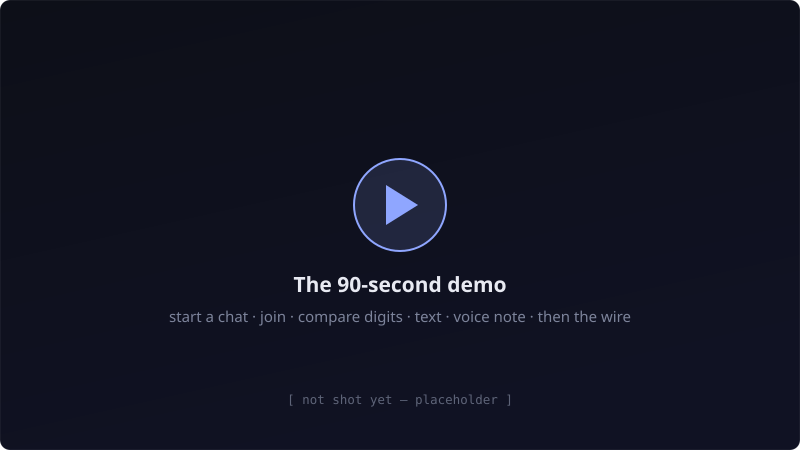
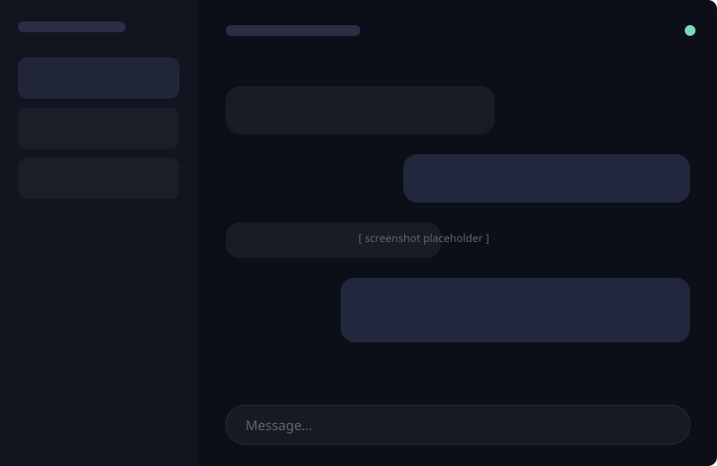
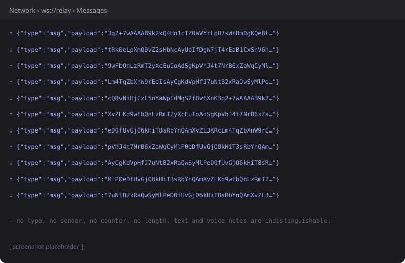
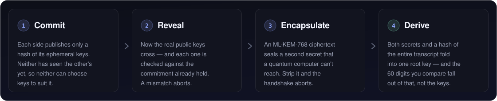

<div align="center">


**Trojan Troy smuggles your conversations past everyone but the person you're talking to.**

[](https://github.com/juanmendoza-dev/Trojan-Troy/actions/workflows/ci.yml)


[Live demo](https://trojan-troy.vercel.app) · [Threat model](SECURITY.md) · [Protocol](docs/protocol.md) · [Devlog](docs/devlog/)

</div>

---

Most "encrypted" chat apps ask you to trust their server. This one is built so the servers honesty literally doesnt matter, it just forwards opaque blobs it has no key for, and every design decision assumes its actively hostile. So basically chatting, but security at the forefront of the whole design. Text and voice, end to end encrypted, with a safety number handshake so you know its really them that ur talking to.

> [!NOTE]
> The relay sleeps when idle so the first connection after a nap can take like 30–60 seconds, sorry about that :( thats Renders free tier being slow, not the handshake

## See it work!!!!

<!-- TODO: replace with the GitHub attachment URL after uploading the .mp4,
     pasted bare on its own line so it renders as an inline player -->

<a href="https://trojan-troy.vercel.app">
  
</a>

Or just open the [live demo](https://trojan-troy.vercel.app) yourself, invite ur friends or open it in two browsers (if you have no friends). "Start a chat" in one, join with the code in the other, thats it.

## What the relay actually sees

<table>
<tr>
<td width="50%" valign="top">
  
  <p align="center"><sub>the app ur friend sees</sub></p>
</td>
<td width="50%" valign="top">
  
  <p align="center"><sub>the exact same conversation but how the relay sees it</sub></p>
</td>
</tr>
</table>

After the handshake every single message: text, voice note, typing indicator, read receipt, shared profile, all of it looks like **exactly one shape** on the wire:

```json
{ "type": "msg", "payload": "3q2+7wAAAAB...base64..." }
```

no message type, no sender key, no counter, no length, no id. The channel, the message id, the voice `mimeType`, the receipt kind, the ratchet position, the senders current ratchet key, all of that lives *inside* the encryption. Even the size gets quantised into fixed buckets, and theres a steady stream of decoy frames flowing whether or not anyone is typing so you cant even tell when someones actually talking.

A hostile relay learns three things: two clients are connected, roughly how long, and how many frames crossed. thats the entire list.

---

## How the security works

Every primitive comes from an audited library: [libsodium](https://doc.libsodium.org/) (sumo build) and [@noble/post-quantum](https://github.com/paulmillr/noble-post-quantum) (Cure53 audited ML-KEM). **Zero hand rolled cryptography.** I compose audited primitives, I dont invent new ones, thats rule number one of this whole project.

### 1. Pairing: a handshake that cant be steered




X25519 **and** ML-KEM-768 secrets both get folded into the root key, so the session stays safe unless *both* are broken, meaning traffic recorded today cant be decrypted by a future quantum computer (uh oh). Strip the post quantum material and the handshake just aborts, theres no classical fallback to downgrade into. As of v6 this covers everything on the wire including the non ratcheted channels.

### 2. Messaging: a Double Ratchet with nothing in the clear

Every message gets a fresh key that gets thrown away immediatly. Fresh ML-KEM secrets get negotiated *in band* and folded into the ratchets root chain like every 30 seconds, so recovering from a compromise doesnt rest on X25519 alone.

<details>
<summary>The 84-byte sealed header, field by field</summary>

The key class, the senders ratchet public key and both chain counters live in a fixed size sealed header, so the relay cant map the conversations structure: who spoke in what bursts, how long each run was, which frames were receipts. it all looks the same.

```
class    1 byte   - msg | presence | ack | profile | kem
ratchet 32 bytes  - sender's current DH public key
N        4 bytes  - message number in the current chain
PN       4 bytes  - length of the previous chain
nonce   24 bytes  - per-frame, never reused
tag     19 bytes  - Poly1305 authenticator
────────────────
        84 bytes, constant, for every frame type
```

</details>

<details>
<summary>Why a forged frame cant corrupt a live session</summary>

Decryption runs on a clone of the session state and only commits on success. A frame that fails to authenticate doesnt consume its replay counter either, so a relay cant mangle one body to lock out the genuine frame queued behind it. And on receive the channel gets checked against an allowlist instead of being trusted from the decrypted JSON.

</details>

### 3. Metadata resistance

A jittered ~1/second stream of decoy frames thats byte indistinguishable from real content (same class, same header shape, same size bucket), so the relay cant read the *rhythm* of a conversation, like typing, pausing, going idle. Real messages still send immediately, **zero added latency.** The presence heartbeat is jittered too so "online" has no fixed period fingerprint.

### 4. At rest, and at the edges

Argon2id (`crypto_pwhash`) derives a vault key from ur profile PIN and seals ur avatar on disk. No fast hash fallback, legacy cleartext records get purged on load, and a page reload reverts you back to Anonymous.

The relay is hardened seperately: 2 MiB payload cap, per connection token bucket rate limiting, per IP and global connection caps, active room caps, heartbeat reaping of half open sockets, one room per peer, and a dedicated join rate bucket against room code enumeration. basicly every way I could think of to abuse it, blocked.

---

## The chat, and why each part of it is a security decision

<table>
<tr>
<td width="33%" valign="top">
  
  <p><sub>60 seconds max, encrypted as raw bytes. The recording bitrate is pinned so a long clip cant exceed the relays 2 MiB cap, because a size rejection would leak something by itself.</sub></p>
</td>
<td width="33%" valign="top">
  
  <p><sub>Almost every chat app sends this in the clear (why!!). Here it rides an encrypted channel bound to the same hybrid root key as the actual messages.</sub></p>
</td>
<td width="33%" valign="top">
  
  <p><sub>Read receipts are opt out. Turning them off stops the frame from being sent at all, instead of just hiding it in the UI.</sub></p>
</td>
</tr>
</table>

Three chat themes (Apple, Iris Glass, Pulse Slate), a kinetic cipher handshake screen, and a mobile layout with an off canvas drawer. The sidebar will also vizualize ur data live if you let it, decoy frames and all.

---

## the no bueno


While auditing the v5 wire format I noticed the presence, read receipt and shared profile channels were derived from the raw `crypto_kx` output, which meant they were **X25519 only**. No ML-KEM, no transcript binding, while the message ratchet correctly took both. So every claim I had written about post quantum protection quietly did not apply to three of my own channels (ouch).

I reproduced it before fixing it: same classical handshake, different PQ secret, and the static keys came out byte identical, proof the post quantum material wasnt reaching them. The fix binds each direction to the hybrid root key, which took `PROTOCOL_VERSION` to 6 and shipped with a direction separation test that fails if the two directions ever get collapsed into one key.

<sub>Commits [`124d533`](https://github.com/juanmendoza-dev/Trojan-Troy/commit/124d533) and [`a593e2a`](https://github.com/juanmendoza-dev/Trojan-Troy/commit/a593e2a). The reasoning is in [docs/devlog/decisions.md](docs/devlog/decisions.md).</sub>

---

## What this does *not* protect you from

Security claims are only worth anything next to their limits, so here are ours plainly 😓😓😓

<table>
<tr>
<td valign="top" width="60" align="center">
  
</td>
<td valign="top">
  <b>Safety number verification is not enforced</b><br>
  <sub>You can walk right past the compare digits screen without comparing anything. If you do that, a hostile relay couldve put itself in the middle and you would not know. Its the biggest real world gap in this project, and its a UX problem not a crypto one.</sub>
</td>
</tr>
</table>

<table>
<tr>
<td valign="top" width="60" align="center">
  
</td>
<td valign="top">
  <b>The per-step DH inside the ratchet is still X25519</b><br>
  <sub>Post quantum material folds in every ~30 seconds, not per message. Per step ML-KEM needs chunked key transmission, thats Signals SPQR direction.</sub>
</td>
</tr>
</table>

<table>
<tr>
<td valign="top" width="60" align="center">
  
</td>
<td valign="top">
  <b>Profile names are stored in the clear</b><br>
  <sub>Only avatars are sealed with Argon2id. Names have to be readable to draw the profile picker before a PIN gets entered, so they sit unencrypted in IndexedDB. Theres also no PIN attempt backoff and a numeric PIN is low entropy, a passphrase is the real fix.</sub>
</td>
</tr>
</table>

<table>
<tr>
<td valign="top" width="60" align="center">
  
</td>
<td valign="top">
  <b>A compromised endpoint sees everything</b><br>
  <sub>No cryptography fixes a compromised device, sorry. The relay also still learns that a session exists, its duration and its frame count, thats inherent to any forwarding relay.</sub>
</td>
</tr>
</table>

If you find something I've missed or mis-stated please reach out to me! I'm genuinely super interested in this type of stuff (encryption/crypto), which is a big part of why this project is opensource, I want others to also learnnn!

---

## How its verified

**251 client tests + 31 server tests**, all on real modules, no mocked crypto. They test the *adversarial* cases not just the happy paths: a one sided post quantum fold **diverges** the session (proving the fold is load bearing), a relabelled frame fails, a replayed frame drops, a tampered header leaves the session usable.

Theres also a committed twobrowser Playwright test (`client/e2e/handshake.spec.ts`) that drives two real browser contexts against a live relay and checks what unit tests cant reach: both browsers derive the identical 60 digit safety number, `commit` comes before `pubkey` on the wire, the handshake advertises the current `PROTOCOL_VERSION`, every `msg` frame carries nothing but `type` and `payload`, and cover traffic keeps flowing while both sides just sit there idle.

```bash
cd server && npm run dev          # the test needs a live relay
cd client && npm run test:e2e
```

## Eleven days, 271 commits

<!-- WRITE THIS. The table is accurate but it reads like a changelog.
     What a judge wants is which of these was hard, what you got wrong the
     first time, and what you cut. Dates are in docs/devlog/progress.md. -->

| Phase | What shipped |
|---|---|
| 1–3 | Key exchange, safety number, encrypted text, encrypted voice notes |
| 4–4.6 | Kinetic-cipher handshake screen, three chat themes, every screen styled |
| 5.1–5.2 | Local profiles behind a PIN, Double Ratchet, sealed framing, padding |
| Security round 1 | Hybrid post-quantum handshake, safety-number binding, relay DoS hardening |
| Security round 2 | PQ ratchet, sealed headers, cover traffic, Argon2id vault |
| v6 | Static-channel PQ binding (the bug above) |
| Mobile | Responsive shell, hamburger drawer, phone-usable composer |

<sub>Time tracked via Hackatime. Built for Hack Club Horizons Polaris, Toronto. IM EXCITED FOR TORONTO!!!!!!!!</sub>

## How I worked

<!-- WRITE THIS. Judges will see .claude/ in the tree, so say it plainly and
     own it. The strongest version points at decisions.md as evidence of your
     calls — especially the ones where you rolled back working code. -->

I used Claude Code as an implementation partner the whole way through, and this repo keeps the paper trail instead of hiding it (its right there in the tree, `.claude/` and everything). [docs/devlog/decisions.md](docs/devlog/decisions.md) records every non obvious call and why I made it, including the ones where I rolled back working code, like retiring the persistent identity branch for device local profiles. The architecture decisions, the security direction and every scope call were mine.

## Run it yourself

Two independent packages:

```bash
cd server && npm install && npm run dev   # relay on ws://localhost:8080
cd client && npm install && npm run dev   # web app, prints its own URL
```

Open the client URL in two windows, "Start a chat" in one, join with the shown code in the other. No accounts, no passwords, no database. Pairing is just a room code or an invite link and session keys die with the tab.

```bash
cd client && npm test && npm run typecheck && npm run build
cd server && npm test
```

Dev only URL overrides jump straight to a screen: `?screen=chat`, `?screen=safety`, `?screen=error`.

<details>
<summary>Deploying your own</summary>

The relay is a stateful WebSocket server (in memory room state) which doesnt fit Vercels serverless model, so the two halves deploy seperately.

**Relay (Render):** "New" → "Blueprint" → point at this repo. `render.yaml` configures the `trojan-troy-relay` service automatically.

**Client (Vercel):** "Add New" → "Project" → import this repo, set Root Directory to `client`, and add `VITE_RELAY_URL` set to the relays `wss://` URL.

Optionally set `ALLOWED_ORIGINS` on the relay (comma separated) to restrict which browser origins can connect, it fails open when unset so a missing value cant lock out production.

</details>

## Where the reasoning lives

This repo keeps its reasoning, not just its code, [docs/](docs/) has the full index. I wrote everything down as I went so you dont have to trust me, you can just check.

| Path | What's in it |
|---|---|
| [`docs/protocol.md`](docs/protocol.md) | The wire protocol on one page: handshake, ratchet, sealed frames, cover traffic |
| [`SECURITY.md`](SECURITY.md) | The threat model and its honest limits, up front |
| [`docs/specs/`](docs/specs/) | Design specs per feature, each with its own residuals section |
| [`docs/reviews/`](docs/reviews/) | The security review that drove much of the hardening above |
| [`docs/devlog/`](docs/devlog/) | Every non obvious decision and why, what shipped and how it was verified |

## Stack

| | |
|---|---|
| Client | React + TypeScript + Vite |
| Crypto | libsodium-wrappers-sumo, @noble/post-quantum |
| Relay | Node + `ws`, in-memory only, **no database** |
| Wire | JSON over WebSocket, `PROTOCOL_VERSION 6` |

### Hard constraints, every phase, no exceptions

1. **Never implement custom cryptographic primitives.** Audited libraries only.
2. **The relay must be architecturally incapable of reading message content.** It only looks at `create` / `join`, everything else gets forwarded verbatim.
3. Live calling and true peer to peer are out of scope for this version (next time!)

<sub>The name: a trojan gets past the wall by not looking like a threat. so does every frame this thing sends.</sub>

<sub>MIT licensed.</sub>
